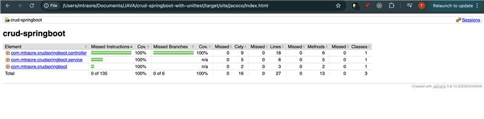

CRUD Spring Boot application with MySQL, including instructions for setting up, running, and testing the application.

```markdown
# CRUD Spring Boot Application with MySQL

This is a simple CRUD (Create, Read, Update, Delete) application built using Spring Boot and MySQL. The application demonstrates basic CRUD operations with a RESTful API.

## Table of Contents

- [Features](#features)
- [Prerequisites](#prerequisites)
- [Setup](#setup)
- [Running the Application](#running-the-application)
- [Testing](#testing)
- [API Endpoints](#api-endpoints)
- [Contributing](#contributing)
- [License](#license)

## Features

- Create, Read, Update, and Delete operations for a sample entity.
- RESTful API endpoints.
- MySQL database integration.
- Unit and integration tests.

## Prerequisites

- Java 17 or higher
- Maven
- MySQL database

## Setup

1. **Clone the Repository**:
    ```sh
    git clone repo-remote
    cd crud-springboot-mysql
    ```

2. **Configure MySQL**:
    - Create a MySQL database:
        ```sql
        CREATE DATABASE crud_db;
        ```
    - Update the `application.properties` file with your MySQL credentials:
        ```properties
        spring.datasource.url=jdbc:mysql://localhost:3306/crud_db
        spring.datasource.username=your_username
        spring.datasource.password=your_password
        ```

3. **Build the Project**:
    ```sh
    mvn clean install
    ```

## Running the Application

You can run the application using Maven:

```sh
mvn spring-boot:run
```

Or you can run the `main` method in the `CrudSpringbootApplication` class from your IDE.

The application will start on `http://localhost:8080`.

## Testing

The application includes unit and integration tests. You can run the tests using Maven:

```sh
mvn test
```

### Unit Tests

Unit tests are located in the `src/test/java` directory. They test individual components of the application, such as controllers, services, and repositories.

### Integration Tests

Integration tests ensure that the application context loads correctly and that the application behaves as expected when interacting with the database.

## API Endpoints

The following endpoints are available:

- **GET** `/api/entities`: Retrieve all entities.
- **GET** `/api/entities/{id}`: Retrieve a single entity by ID.
- **POST** `/api/entities`: Create a new entity.
- **PUT** `/api/entities/{id}`: Update an existing entity.
- **DELETE** `/api/entities/{id}`: Delete an entity by ID.

## Contributing

Contributions are welcome! Please open an issue or submit a pull request.

## License

This project is licensed under the MIT License. See the [LICENSE](LICENSE) file for details.


### Explanation:

- **Features**: Lists the key features of the application.
- **Prerequisites**: Lists the software and tools required to run the application.
- **Setup**: Provides step-by-step instructions for setting up the project.
- **Running the Application**: Explains how to run the application.
- **Testing**: Describes how to run the tests and provides a brief overview of the types of tests included.
- **API Endpoints**: Lists the available API endpoints.
- **Contributing**: Encourages contributions and provides a link to the issue tracker.
- **License**: Specifies the license under which the project is distributed.
- **Test Coverage Section**: Added a new section titled "Test Coverage" to include the image.
